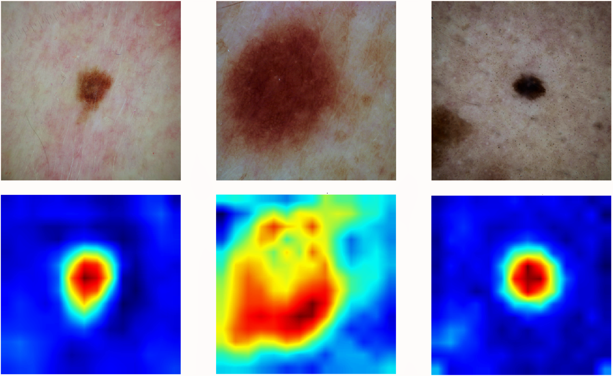

# Ensemble of Convolutional Neural Networks for Disease Classification of Skin Lesions
**Problem Statement**: Fully supervised binary classification of skin lesions from dermatoscopic images. 

**Note**: The following approach won **1st place in the 2019 Computer-Aided Diagnosis: Deep Learning in Dermascopy Challenge** at [Universitat de Girona](https://www.udg.edu) scoring **92.2% accuracy (kappa: 0.819) at test-time**, during the 2018-20 Joint Master of Science in [Medical Imaging and Applications (MaIA)](https://maiamaster.udg.edu) program.  

**Acknowledgments**: Pavel Yakubovskiy for the TensorFlow.Keras implementation of [EfficientNet](https://github.com/qubvel/efficientnet), [SEResNeXt-101 and SENet-154](https://github.com/qubvel/classification_models), and Mina Sami for the Python implementation of [Shades of Gray Color Constancy](https://github.com/MinaSGorgy/Color-Constancy). 

**Data**: *Class A*: Nevus; *Class B:* Other (Melanoma, Dermatofibroma, Pigmented Bowen's, Basal Cell Carcinoma, Vascular, Pigmented Benign Keratoses) [4800/1200/1000 : Train/Val/Test Ratio]
 
**Directories**  
  ● Preprocessing Pipeline for Color Space/Constancy: `scripts/color-io.ipynb`  
  ● Individual Model Training-Validation Pipeline: `scripts/train-val.ipynb`  
  ● Ensemble Validation Pipeline: `scripts/ensemble-val.ipynb`  
  ● Ensemble Inference Pipeline: `scripts/ensemble-test.ipynb`               
  
## Train/Test-Time Data Augmentation  

*Figure 1.  All 5 different types of data augmentation [vertical (b)/horizontal (c) flips, brightness shift (d), saturation (e)/contrast (f) boost) used at train-time to broaden the data representation beyond limited pre-existing samples, and test-time to ensure a full prediction from the classifier that is unaffected by the orientation or lighting conditions of the scan. Predictions from all 6 variations [including the original (a)] are averaged to obtain the final prediction per sample.* 
   
     
## Multi-Scale Input  

*Figure 2.  Original RGB image (left), center cropped 448 x 448 x 3 image used to train 3 CNN member models and the further center cropped 224 x 224 x 3 image used to train 2 more CNN member models. Each model learns to classify at a different scale, with the hypothesis that the collective ensemble benefits from a multi-scale input.* 

    
## Feature Maps  

*Figure 3.  Features maps derived from the output of the second block of expanded convolutional layers in a pre-trained EfficientNet-B6 with ImageNet weights, after passing an input skin lesion image through the network.*  
 
*Figure 4.  Features maps derived from the output of the second block of expanded convolutional layers in a finetuned EfficientNet-B6 initialized with ImageNet weights, after passing an input skin lesion image through the network.*   
  

## Experimental Results 
*Figure 5.  Validation performance for the collective ensemble and each member model.* 

## Gradient Class Activation Maps 

*Figure 6.  Gradient–Class Activation Maps (Grad-CAM) from finetuned EfficientNet-B6 –using  the gradients of the nevus class flowing into the final convolutional layer, to produce a coarse localization map highlighting important regions in the image for predicting nevus.* 

