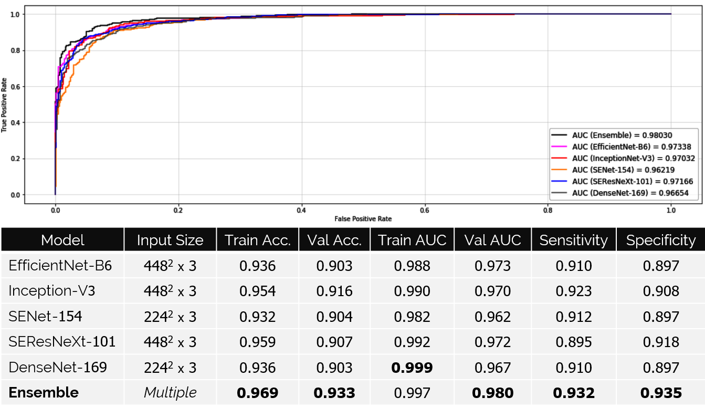

# Ensemble of Convolutional Neural Networks for Disease Classification of Skin Lesions
**Problem Statement**: Fully supervised binary classification of skin lesions from dermatoscopic images. 

**Note**: The following approach won 1st place in the **2019 Computer-Aided Diagnosis: Deep Learning in Dermascopy Challenge** at [Universitat de Girona](https://www.udg.edu) scoring **92.2% accuracy (kappa: ___) at test-time**, during the 2018-20 Joint Master of Science in [Medical Imaging and Applications (MaIA)](https://maiamaster.udg.edu) program.  

**Acknowledgments**: Pavel Yakubovskiy for the TensorFlow.Keras implementation of [EfficientNet](https://github.com/qubvel/efficientnet), [SEResNeXt-101 and SENet-154](https://github.com/qubvel/classification_models), and Mina Sami for the Python implementation of [Shades of Gray Color Constancy](https://github.com/MinaSGorgy/Color-Constancy). 

**Data**: *Class A*: Nevus; *Class B:* Other (Melanoma, Dermatofibroma, Pigmented Bowen's, Basal Cell Carcinoma, Vascular, Pigmented Benign Keratoses) [4800/1200/1000 : Train/Val/Test Ratio]
 
**Directories**  
  ● Preprocessing Pipeline for Color Space/Constancy: `scripts/color-io.ipynb`  
  ● Individual Model Training-Validation Pipeline: `scripts/train-val.ipynb`  
  ● Ensemble Validation Pipeline: `scripts/ensemble-val.ipynb`  
  ● Ensemble Inference Pipeline: `scripts/ensemble-test.ipynb`               
  
## Train/Test-Time Data Augmentation  

 
   
    
## Feature Maps  

 
 
 
  

## Experimental Results 
 

## Gradient Class Activation Maps 

 

